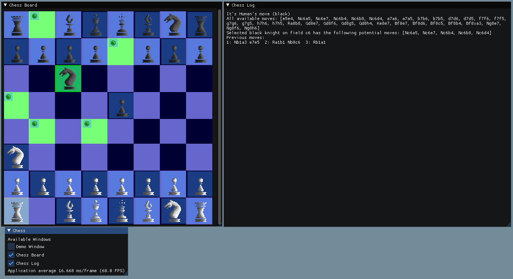

# Chess Engine and GUI

This is going to be a simple chess engine allowing local matches between two humans, human vs CPU or CPU vs CPU.
There are two reasons for its creation. I wanna improve my understanding of chess and I wanna train my C++ skills
as my work doesn't allow me to do that currently.

# Usage

The project crates three binaries:
* libchess library -> The engine
* run_chess executable -> A simple command line executable that uses the library. See below for details of its function
* chess_gui executable -> A GUI based chess programm that has currently very limited feature support

# How to build

## Prerequisites

* C++20 compatible compiler (Tested with clang >=15 and gcc >=13)
* cmake >= 3.13
* googletest installed

## Build

* Clone repo and sync / update submodules
* mkdir build && cd build
* cmake ..
* make

# libchess details

This is work in progress

## What the library can do

* Create an empty chess board
* Create a chess board in its start configuration for a game
* Create a chess board from a FEN String
* Display a chess board in ASCII
* Represent chess moves (class Move)
* Apply a chess move to a board
* Display a chess move in Long Algebraic Notation
* Determine potential moves for a given board
* En Passant moves
* Promotion moves
* Castling moves
* Check / Check-Mate / Stale-Mate detection
* Play a chess game in console. PvP or PvE or EvE
* Simulate chess games between stupid KIs

## What the library can't do yet

* Manipulate a board via command line
* Implement board -> possible moves -> check/check-mate/stale-mate information caching
* Be properly tested  ;-)

# run_chess details

The current implementation offers three operation modes of the executable:

## Analyze FEN Strings

By using the '-f' option the executable reads in [FEN Strings](https://www.chess.com/terms/fen-chess#en-passant-targets) via stdin
and prints the board in ASCII style and shows the valid moves for the color whos turn it is currently.

Try it:
```bash
echo "k1p5/8/P1r1p3/8/8/2P1R2p/8/K3P3 b - -" | run_chess -f
```

You could also use the include FEN String Generator to create a number of random FEN Strings and pass it directly to the executable:
```bash
./fen_gen.py 10 | run_chess -f
```

## Play a match against a really stupid AI

By using the '-g' option the user can play a game against a very stupid computer that always picks a random available move.
The board is printed and the user can select a move from a list of available moves. User-friendliness 0/10 :)

## Simulate a number of matches between two stupid AIs

By using the '-s 10' option 10 (or whatever number you pick) matches between two stupid AIs can be simulated and the result
of each match is printed to the console.

# chess_gui details

Currently the GUI starts and shows a chess board and a log window. On the chess board you can
play as black against the same stupid AI as in the run_chess executable. When it's your turn,
just click a piece and then click on one of the valid move options.

See the following example


# Licenses and external dependencies

* [This engine is published under MIT license](LICENSE)
* Depends on [aelib](https://github.com/minusbrain/aelib) - MIT License
* Depends on [fmt](https://github.com/fmtlib/fmt) - MIT License
* Depends on [imgui](https://github.com/ocornut/imgui) - MIT License
* Depends on [nlohmann/json](https://github.com/nlohmann/json) - MIT License
* Sprites from [Rad Potato](https://rad-potato.itch.io/pixel-perfect-ultimate-game-component-kit) - Creative Commons

# Ideas

[Ideas for future changes](ideas.md)